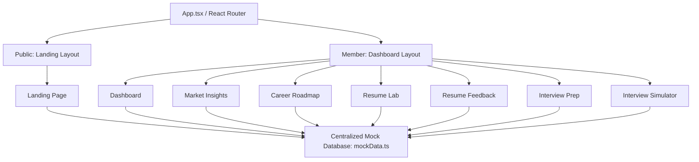

# 🎯 CareerTrack AI Intelligence Platform

> **A State-of-the-Art, Data-Driven Career Accelerator & AI Mentorship Suite.**
> Empowering professionals with real-time market telemetry, interactive ATS optimization, structured career roadmapping, and simulated conversational coaching.

---

## 🚀 Project Overview

**CareerTrack AI** is an advanced career intelligence ecosystem designed to demystify professional development. By combining high-impact analytics, dynamic roadmaps, and modern design systems, the platform empowers users to navigate the modern job market with clarity and confidence.

Unlike generic career portals, CareerTrack AI bridges the gap between **raw ambition** and **market viability**. The system continuously references your current resume, assesses skill gaps, analyzes local geographical market pulses, and generates bespoke system-design and coding roadmaps to accelerate your trajectory to senior and leadership engineering positions.

---

## ✨ Features & Functionalities

### 1. 📊 Career Intelligence Dashboard
A central hub organizing your daily career briefings, activity streak visualizations, and next critical milestones:
- **Bento Grid Architecture:** Structured layout summarizing milestones, progress, and upcoming tasks.
- **Telemetry Indicators:** Highly-interactive progress wheels depicting overall career milestone completeness.
- **Activity Streaks:** Dynamic daily activity analytics that keep you engaged and accountable.

### 2. 🗺️ Career Roadmap & Skill Gap Analyzer
Bridges the gap between where you are and where the market needs you to be:
- **Visual Milestones:** Interactive multi-phase timeline showing completed, active, and locked engineering roadmap milestones.
- **Skill Gap Auditing:** Visual status indicators highlighting active vs. missing skills, complete with custom suggestion highlights.
- **AI Suggested Learning Modules:** Direct course/learning suggestions detailing exactly what study materials to review next.

### 3. 🧪 Resume Lab & ATS Engine
Stop sending resumes into black holes. Parse and test your resume before applying:
- **Mock Parser:** Upload simulation that outputs an immediate ATS score out of 100.
- **Actionable AI Warnings:** Critical reminders (e.g., "Quantify your impact") based on modern recruiter heuristics.
- **Machine Readability Audits:** Immediate checklist reviews assessing document layout, font usage, and complex graphics compatibility.

### 4. 📝 AI Resume Feedback Report
An in-depth report detailing exact revisions based on industry best practices:
- **Google X-Y-Z Formula Analysis:** Teaches you how to write accomplishments using the high-impact format: *Accomplished [X] as measured by [Y], by doing [Z]*.
- **Priority Fixes Card:** Structured logs warning users about formatting issues, missing keywords, and unquantified metrics.
- **Detailed Skill Matcher:** Highlights exactly which target keywords are matched or missing.

### 5. 📉 Market Insights & Salary Analytics
Demystify compensation and skill demands through interactive analytics:
- **Visual Salary Whisker Charts:** Live interactive diagrams depicting median, minimum, and maximum ranges by role, experience levels, and locations.
- **Geographical Tech Hub Pulses:** Direct trending hubs (e.g., SF Bay Area, NYC, Austin) tracking AI/GenAI and Cloud/Security growth margins.
- **Skill Premiums Index:** Highlighted high-paying skills tracking value multipliers (e.g., PyTorch / LLM tuning, Kubernetes orchestration).

### 6. 🤖 Conversational AI Interview Simulator
Train interactively with a virtual AI recruiter:
- **Interactive Chat Interface:** Immersive terminal simulation facilitating back-and-forth dialogue.
- **Real-Time Live Coaching Metrics:** Real-time feedback measuring *Confidence Index*, *Pacing Rate*, and response depth.
- **Target Role Validation:** Displays the standard job requirements alongside your resume highlights to help you align responses.

---

## 🏛️ System Design & Architecture

CareerTrack AI is built on a modern, modular architecture, ensuring a complete separation of presentation layers, routing, and centralized database logic.



### 🛠️ Tech Stack & Design System
- **Core Framework:** React 19 + TypeScript 5
- **Styling:** Tailwind CSS v4 + Vanilla CSS Orbiting & Pulsing Animations
- **Icons & Typography:** Google Fonts (Outfit & Inter) + Material Symbols
- **Development Tooling:** Vite 6 + ESLint

---

## 🗺️ Application Routing Map

The application's route parameters are organized securely under `src/App.tsx`:

| Path | Layout | Component | Purpose |
|:---|:---|:---|:---|
| `/` | `LandingLayout` | `Landing.tsx` | Marketing landing page & value proposition |
| `/dashboard` | `DashboardLayout` | `Dashboard.tsx` | Central bento insights dashboard |
| `/discovery` | `DashboardLayout` | `MarketInsights.tsx` | Regional compensation & skill analytics |
| `/roadmap` | `DashboardLayout` | `CareerRoadmap.tsx` | Interactive skill gap timelines |
| `/resume` | `DashboardLayout` | `ResumeLab.tsx` | ATS resume parsing playground |
| `/resume/feedback` | `DashboardLayout` | `ResumeFeedback.tsx` | Advanced XYZ formula feedback report |
| `/interview` | `DashboardLayout` | `InterviewPrep.tsx` | Coaching preparation & simulation prep |
| `/interview/simulator` | `DashboardLayout` | `InterviewSimulator.tsx`| Interactive live interview training console |

---

## 🔧 Run & Install Locally

Follow these easy steps to launch your local career intelligence platform instance:

### 1. Prerequisites
Ensure you have [Node.js](https://nodejs.org/) installed (v18+ recommended).

### 2. Install Dependencies
Clone the repository and install the standard dependencies:
```bash
npm install
```

### 3. Setup Environment Variables
Create a `.env` file in the root directory (this is gitignored to protect secret keys):
```ini
# Groq API Configuration
VITE_GROQ_API_KEY=your_groq_api_key_here

# Gemini API Configuration
VITE_GEMINI_API_KEY=your_gemini_api_key_here

# Supabase Credentials
VITE_SUPABASE_URL=https://your-project.supabase.co
VITE_SUPABASE_ANON_KEY=your-anon-key-here

# Demo Credentials
VITE_DEMO_EMAIL=demo@careertrack.ai
VITE_DEMO_PASSWORD=DemoUser2026!
```

> [!WARNING]
> Never commit `.env` or other configuration files containing credentials directly to the repository. Standard exclusions are already configured inside [.gitignore](file:///.gitignore).

### 4. Run Development Server
Start the local Vite development server:
```bash
npm run dev
```
Open your browser and navigate to `http://localhost:3000` to interact with the platform.

### 5. Production Compiling & Verification
To test build integrity and typesafety:
```bash
# Run typescript verification
npm run lint

# Compile production bundle
npm run build
```
